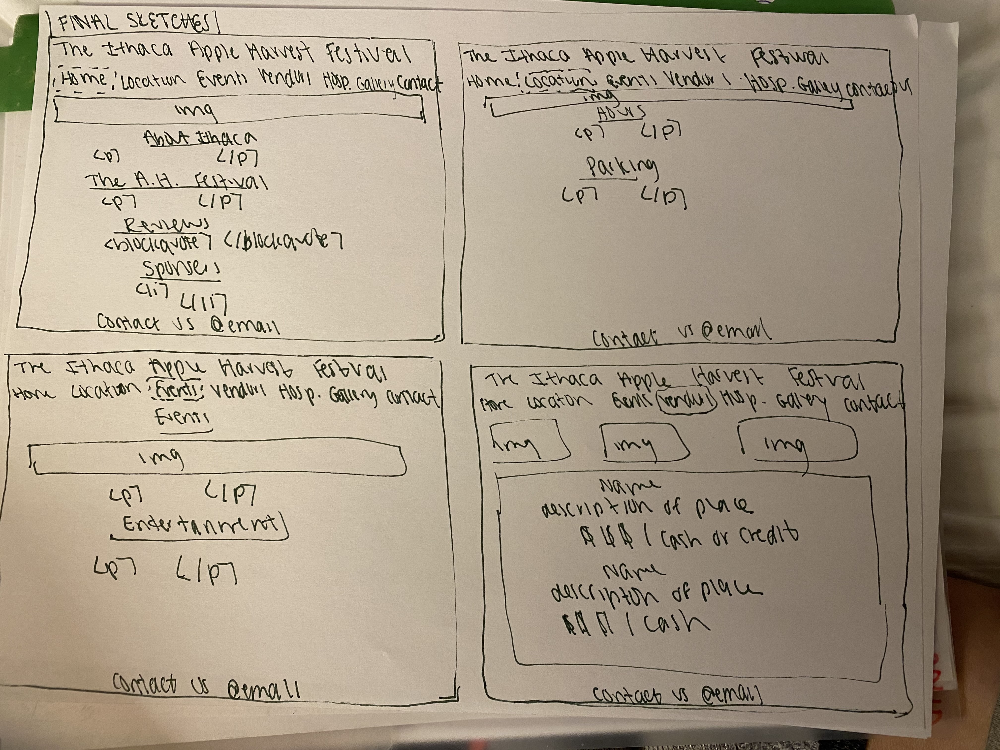
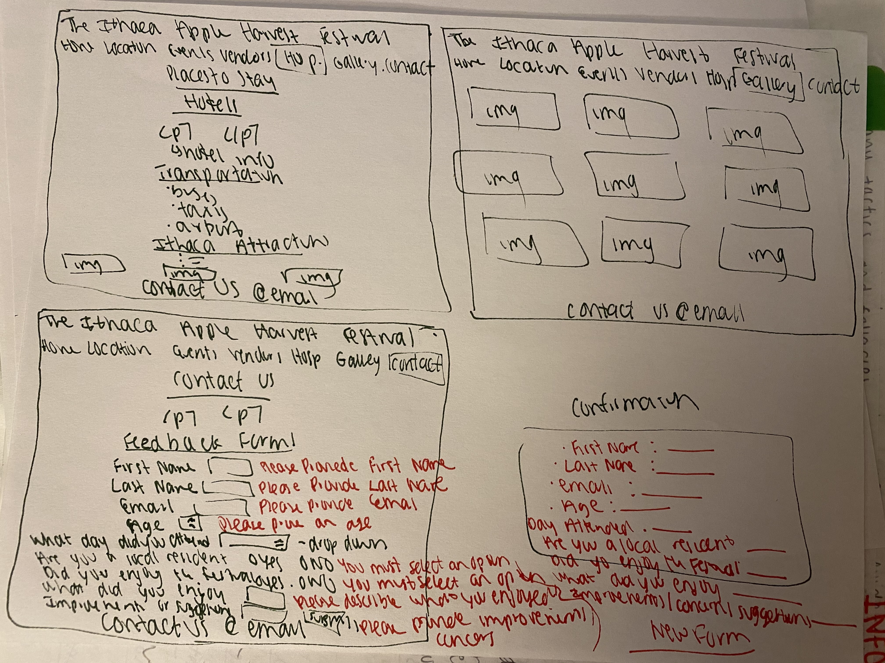
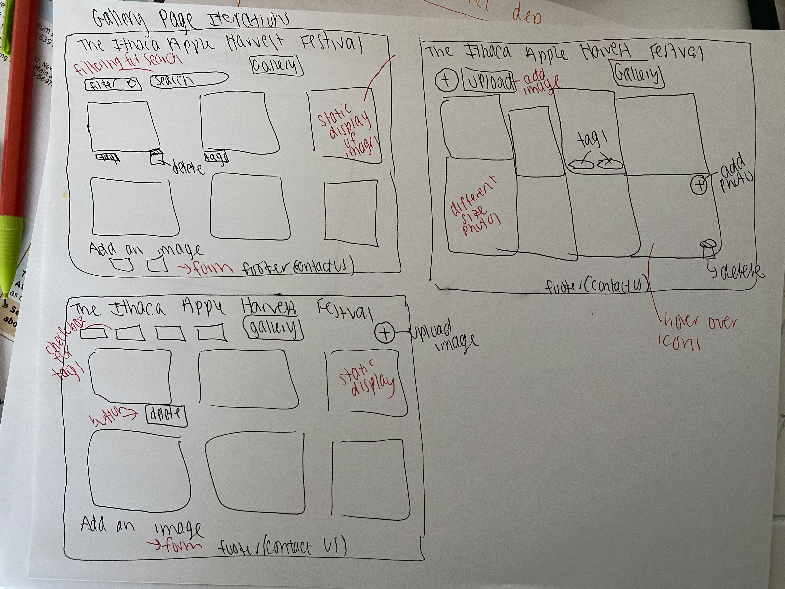
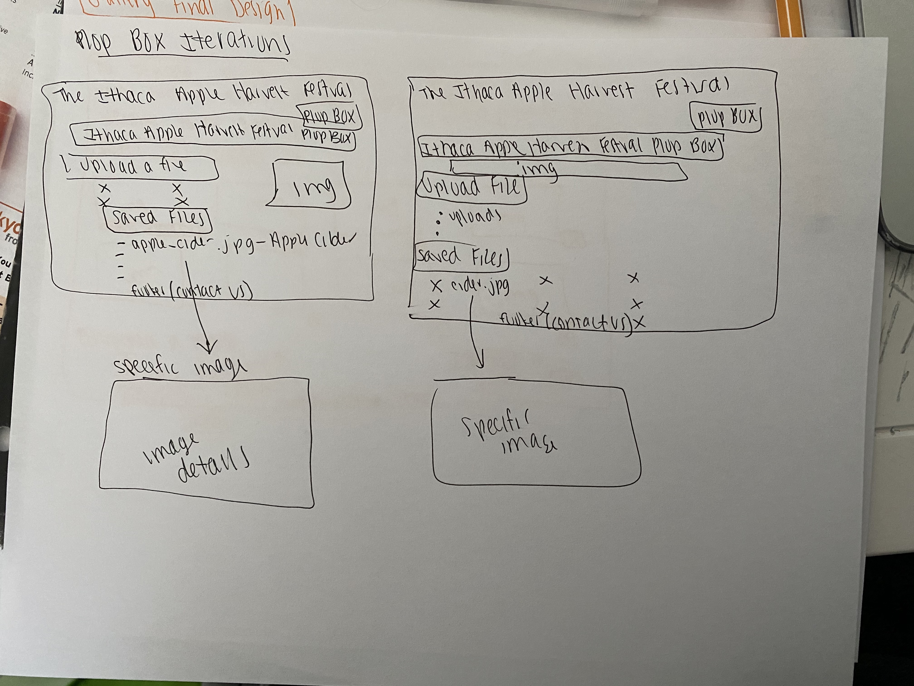
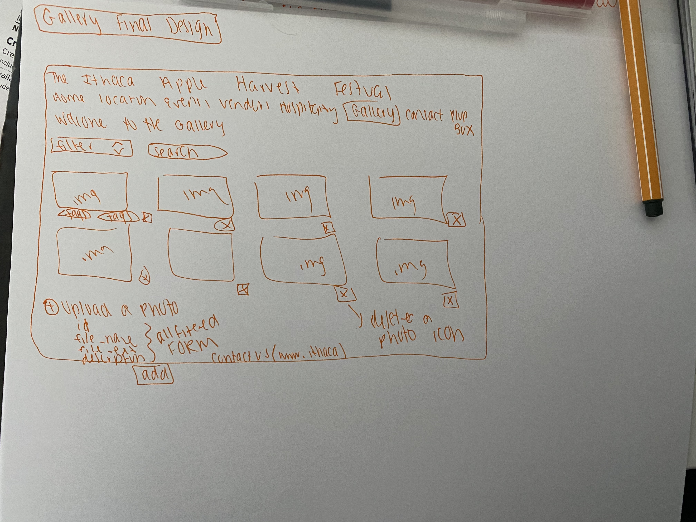
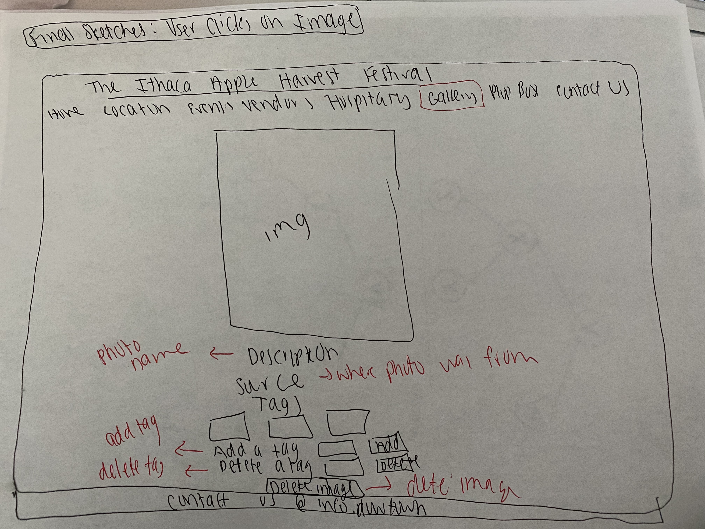
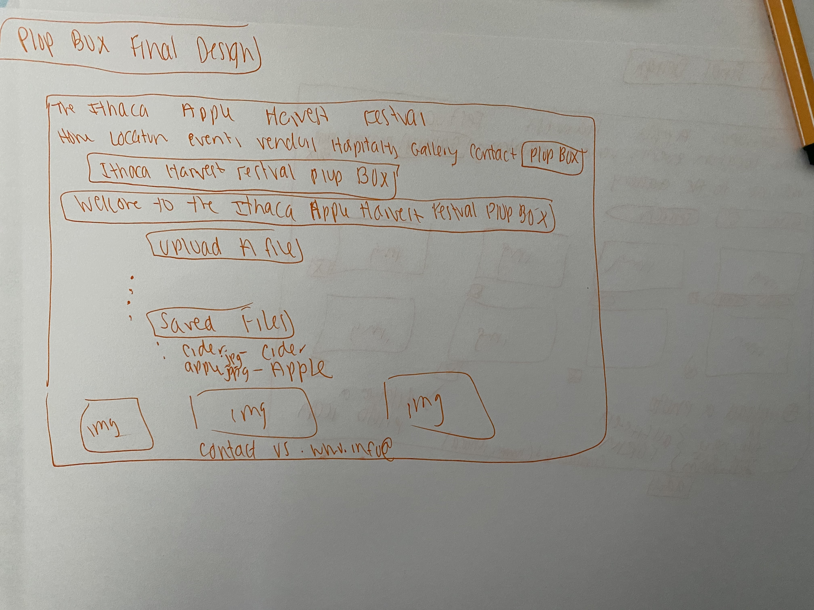

# Project 3: Design Journey

Be clear and concise in your writing. Bullets points are encouraged.

**Everything, including images, must be visible in VS Code's Markdown Preview.** If it's not visible in Markdown Preview, then we won't grade it.

# Design & Plan (Milestone 1)

## Describe your Gallery (Milestone 1)
> What will your gallery be about? 1 sentence.

My gallery will be about the Ithaca Apple Harvest Festival!

> Will you be using your existing Project 1 or Project 2 site for this project? If yes, which project?

Yes, project 1.

> If using your existing Project 1 or Project 2, please upload sketches of your final design here.



## Target Audience(s) (Milestone 1)

> Tell us about your target audience(s).

My first target audience is local Ithaca Residents. This website is encourages the attendance of family, friends, and residents to enjoy a fall day at the heart of Ithaca. The event is family friends and delicious fall foods will be available  for purchase. Entertainment will also be provided. Come join us for a weekend of friends, food and funk to celebrate the beauty of Ithaca in the fall! My secondary target audience is targetted at out of town visitors(non local residents of Ithaca) who are interesting in getting to learn about Ithaca and the culture, scenery and eviornment they have to offer.

In order to encompass both target audiences I added a gallery page as well as a plop box page where user are about to upload a file as well as see saved files from the gallery.

## Design Process (Milestone 1)
> Document your design process. Show us the evolution of your design from your first idea (sketch) to design you wish to implement (sketch). Show us the process you used to organize content and plan the navigation (card sorting), if applicable.
> Label all images. All labels must be visible in VS Code's Markdown Preview.
> Clearly label the final design.

Since, I used my previous project 1, I did not complete a cart sort. I decided to add an enirely new gallery page where the user can view a gallery of a variety of food, drinks, and entertainment the festival has to offer.


This page provides a bunch of different iterations of how I want my gallery to look, how I want to add and delete a photo, as well as what I want to do about tags.


These are my iterations for the plopbox.


This is what I predict my final gallery will look like. A form to add a class and a search bar to filter through different tags. I am adding some icons to delete specific photos as well as a click function to view a singular image.

This is my final design to view image details, view enlarged image, be able to delete an image, adding and removing tags for that specific image.

This is my final layout design for the plopbox.
## Design Patterns (Milestone 1)
> Explain how your site leverages existing design patterns for image galleries.
> Identify the parts of your design that leverage existing design patterns and justify their usage.
> Most of your site should leverage existing patterns. If not, fully explain why your design is a special case (you need to have a very good reason here to receive full credit).

My site leverages existing design patterns for image galleriers becuase it clearly lists a bunch of different pictures that provide a very specific value to the overall target audience. For example, I have a variety of people, food, drinks, location as well as entertainment pictures in my gallery to encompass all that the Ithaca Harvest Festival has to offer. T

The images are all sited and have the ability to be zoomed in if you click on the specific picture. There is also a tag line below each picture describing the picture and its intended purpose. The user can filter the image gallery based on a keyword in order to make the navigation easier. There is an upload icon where the user can easily add a photo to the collection. I want to add some icons to make it more lively and interactive with the user. I am thinking about adding some javascript and hover information.


## Requests (Milestone 1)
> Identify and plan each request you will support in your design.
> List each request that you will need (e.g. view image details, view gallery, etc.)
> For each request, specify the request type (GET or POST), how you will initiate the request: (form or query string param URL), and the HTTP parameters necessary for the request.

Example:
- Request: gallery details
  - Type: GET
  - Params: id _or_ gallery_id (gallery.id in DB) under the gallery table

- Resquest: see when an image is clicked on
    - Type: GET
    - Params: id


- Resquest: Searching a tag
    - Type: GET
    - Params: image_id, tag_id


## Database Schema Design (Milestone 1)
> Plan the structure of your database. You may use words or a picture.
> Make sure you include constraints for each field.

> Hint: You probably need `images`, `tags`, and `image_tags` tables.

> Hint: For foreign keys, use the singular name of the table + _id. For example: `image_id` and `tag_id` for the `image_tags` table.


Example:
```
CREATE TABLE images(
    id INTEGER NOT NULL PRIMARY KEY AUTOINCREMENT UNIQUE,
    image_name TEXT,
    image_ext TEXT,
    description TEXT,
    source TEXT

);

CREAT TABLE tags (
    id INTEGER NOT NULL PRIMARY KEY AUTOINCREMENT UNIQUE,
    tag_name TEXT
)

CREATE TABLE image_tags (
    id INTEGER NOT NULL PRIMARY KEY AUTOINCREMENT UNIQUE,
    images_id INTEGER NOT NULL,
    tags_id INTEGER NOT NULL
)
)
```


## Database Query Plan (Milestone 1)
> Plan your database queries. You may use natural language, pseudocode, or SQL.
> Using your request plan above, plan all of the queries you need.

<!-- Searching specific tags -->
"SELECT * FROM tags INNER JOIN image_tags ON tags.id = image_tags.tags_id INNER JOIN images ON image_tags.images_id = images.id WHERE tags.tag_name LIKE '%' || :search || '%'";

<!--Search for tags -->
 $sql = "SELECT * FROM images WHERE LOWER(name)= :name;";

 <!-- View all Tags  -->
 "SELECT * FROM tags";
<!-- Deleting an Image -->
"SELECT * FROM images WHERE images.id=:image_delete";
"DELETE FROM images WHERE images.id=:image_delete";
"DELETE FROM image_tags WHERE image_tags.images_id=:image_del";

<!-- Adding a Tag -->
"SELECT * FROM tags WHERE tags.tag_name = :input";
"SELECT * FROM tags WHERE tags.tag_name = :input";
"INSERT INTO image_tags(tags_id, images_id) VALUES (:id_add, :image_add)";

<!-- Deleting a Tag -->
"DELETE FROM image_tags
WHERE tags_id = :tag_del AND images_id = :current_image" ;
"SELECT id FROM tags WHERE tag_name IS :current_tag_name";
<!-- Join tags for images -->
$sql = "SELECT * FROM image_tags
INNER JOIN images ON image_tags.images_id = images.id
INNER JOIN tags ON image_tags.tags_id=tags.id
WHERE images.id=:image";

## Code Planning (Milestone 1)
> Plan what top level PHP pages you'll need.

- index.php - page is the homepage
- contact.php - contact information page
- events.php - events of festival
- hospitality.php - contains information on places to stay and things to do
- location.php - states the location of the festival
- vendors.php - includes informatino about the vendors of the festival
- init.php  - contains information to open the databse
- header.php - page contains the header
- footer.php - footer to the page
- gallery.php - this is the gallery page
- plopbox.php - this is where you can view and sort the files in the webpage


> Plan what partials you'll need.

- I will be adding a PHP header to include the navigation bar to the gallery
- I will also be adding a footer partial to the gallery page in order for the user to contact someone with more details

> Plan any PHP code you'll need.

Example:
```
Put all code in between the sets of backticks: ```
Will need PHP code to filter all of the information on the form

To Upload an image;
 creating a form where the user can input the id that has to be unique and has a description file name and file extension

To Delete a file;
if the user uploaded image (Select image_id from gallery WHERE id = 1) then
show all tage (SELECT * from tags WHERE image_id = 1)
if the user clicks on the delete link , then
(DELETE tag_id = 2 for image_id = 4 image_tags table)
 ```
```


# Complete & Polished Website (Final Submission)

## Gallery Step-by-Step Instructions (Final Submission)
> Write step-by-step instructions for the graders.
> For each set of instructions, assume the grader is starting from index.php.

Viewing all images in your gallery:
1. Starting from the index.php page look at the header
2. Click the gallery page
3. You should see a full image gallery containing 12 pictures

View all images for a tag:
1. Starting from the index.php page look at the header
2. Click on the gallery page
3. You should now see a full image gallery containing 12 picture and a search box that has a placeholder # apples
4. at the bottom of the gallery.php page in the left corner above their header there is a black box containing the text tags with a list of all the 5 tags associated with my gallery.
5. Type into the serach box the tag you are looking for and the images will appear with that tag with a feedback message "View the images tagged: #____"
6. For example type #apples into the serach bar and you will receive a message "View the images tagged: #apples with 7 images attached.

View a single image and all the tags for that image:
1. Starting at the index.php page look at the header
2. Click on the gallery page
3. You should now be viewing a gallery with 12 pictures and a search bar
4. Click on a singular image
5. it will take you to a image_details page linked to the gallery.php page
6. this page will included an enlarged photo of the one that you clicked on, the name of the image, the source of the image, the tags associated with that image, an option to edit the tags for example add or delete a tag, it finally gives you the option to remove that image which will be deleted with a feedback message and will then be deleted from the entire gallery page
7. to navigate back to the gallery page press gallery in the header

How to upload a new image:
1. Starting at the index.php page look at the header
2. Click on the plop box page
3. click upload image
4.provide a caption (caption is required you should receive a feedback message if you don't fill out categories)
5. press upload file and it should show up in the uploads folder as well as show up on the gallery page
    - you should receive a feedback message that it was sucessfully uploaded

How to delete an image:
1. Starting at the index.php page look at the header
2. Click on the gallery page
3. You should now be viewing a full gallery page containing 12 images and a search bar
4. Click on one of the images
5. You should now be viewing an enlarged image of the one you selected on, the name of the image, the source, the tags, an option to add a tag, an option to delete a tag, and a Delete imgae button
6. Click on the delete imgage button
    - you should receive a feedback message "The image has been removed from the gallery!"
    - if you return to the gallery page, the image should be removed as well

How to view all tags at once:
1. Starting at the index.php page look at the header
2. Click on the gallery page
3. scroll down to the bottom of the page
4. View all tags listed out in a black background box with each tag outlined in red
    - when a tag is added to an image it also adds to this All Tags section
    - when a tag is deleted from an image it also deletes that tag from the section

How to add a tag to an existing image:
1. Starting at the index.php page look at the header
2. Click on the gallery page
3. You should now be viewing a full gallery page containing 12 images and a search bar
4. Click on one of the images
5. You should now be viewing an enlarged image of the one you selected on, the name of the image, the source, the tags, an option to add a tag, an option to delete a tag, and a Delete imgae button
6. Type in the tag that you want to add and click Add
    - you should now see that tag added to the page
    - if you type a tag that is already present a repeat tag will not be created
        - ex. if photo has a tag #apple and you try and add #apple the tag will not be duplicated

How to remove a tag from an existing image:
1. Starting at the index.php page look at the header
2. Click on the gallery page
3. You should now be viewing a full gallery page containing 12 images and a search bar
4. Click on one of the images
5. You should now be viewing an enlarged image of the one you selected on, the name of the image, the source, the tags, an option to add a tag, an option to delete a tag, and a Delete imgae button
6. Type in the tag that you want to delete and click delete
    - you should now see that tag deleted from the image


## Reflection (Final Submission)
> Take this time to reflect on what you learned during this assignment. How have you improved since starting this class?


This assignment was very challenging. I found it really hard to transition from get to post along with PHP as well as the database. I struggled with the JOINS and then remembering to remove the tags or image from both of the tables. I thought this assignment made it hard becasue it was also hard to debug my own code when their was a mistake. However, this project when completed was really rewarding and through all the frustration I am pleased with how it turned out.

I have improved tremendously throughouht this class. It has taught me a lot about hard work, problem solving and persistance. I think I have improved my coding skills and being comfortable with making my mistakes and learning how to then solve them.  I hope you enjoyed my project. Stay safe and thanks for all of your hard work! :)
