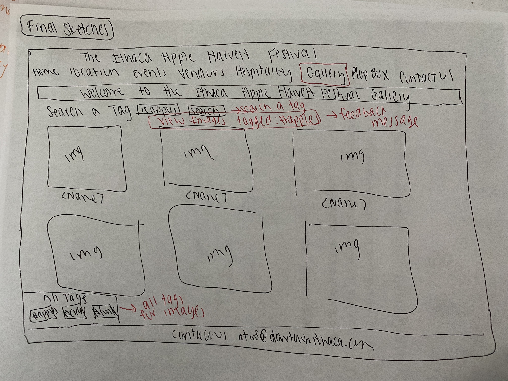
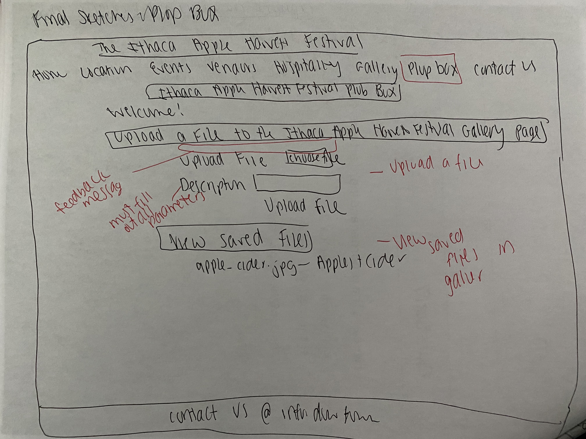

# Project 3: Design Journey

Be clear and concise in your writing. Bullets points are encouraged.

**Everything, including images, must be visible in VS Code's Markdown Preview.** If it's not visible in Markdown Preview, then we won't grade it.

# Design & Plan (Milestone 1)

## Describe your Gallery (Milestone 1)
> What will your gallery be about? 1 sentence.

My gallery will be about the Ithaca Apple Harvest Festival!

> Will you be using your existing Project 1 or Project 2 site for this project? If yes, which project?

Yes, project 1.

> If using your existing Project 1 or Project 2, please upload sketches of your final design here.


## Target Audience(s) (Milestone 1)

> Tell us about your target audience(s).

My first target audience is local Ithaca Residents. This website is encourages the attendance of family, friends, and residents to enjoy a fall day at the heart of Ithaca. The event is family friends and delicious fall foods will be available  for purchase. Entertainment will also be provided. Come join us for a weekend of friends, food and funk to celebrate the beauty of Ithaca in the fall! My secondary target audience is targetted at out of town visitors(non local residents of Ithaca) who are interesting in getting to learn about Ithaca and the culture, scenery and eviornment they have to offer.

In order to encompass both target audiences I added a gallery page as well as a plop box page where user are about to upload a file as well as see saved files from the gallery.

## Design Process (Milestone 1)
> Document your design process. Show us the evolution of your design from your first idea (sketch) to design you wish to implement (sketch). Show us the process you used to organize content and plan the navigation (card sorting), if applicable.
> Label all images. All labels must be visible in VS Code's Markdown Preview.
> Clearly label the final design.

Since, I used my previous project 1, I did not complete a cart sort. I decided to add an enirely new gallery page where the user can view a gallery of a variety of food, drinks, and entertainment the festival has to offer.


This page provides a bunch of different iterations of how I want my gallery to look, how I want to add and delete a photo, as well as what I want to do about tags.


These are my iterations for the plopbox.


This is what I predict my final gallery will look like. A form to add a class and a search bar to filter through different tags. I am adding some icons to delete specific photos as well as a hover function.

This is my final layout design for the plopbox.
## Design Patterns (Milestone 1)
> Explain how your site leverages existing design patterns for image galleries.
> Identify the parts of your design that leverage existing design patterns and justify their usage.
> Most of your site should leverage existing patterns. If not, fully explain why your design is a special case (you need to have a very good reason here to receive full credit).

My site leverages existing design patterns for image galleriers becuase it clearly lists a bunch of different pictures that provide a very specific value to the overall target audience. For example, I have a variety of people, food, drinks, location as well as entertainment pictures in my gallery to encompass all that the Ithaca Harvest Festival has to offer. T

The images are all sited and have the ability to be zoomed in if you click on the specific picture. There is also a tag line below each picture describing the picture and its intended purpose. The user can filter the image gallery based on a keyword in order to make the navigation easier. There is an upload icon where the user can easily add a photo to the collection. I want to add some icons to make it more lively and interactive with the user. I am thinking about adding some javascript and hover information.


## Requests (Milestone 1)
> Identify and plan each request you will support in your design.
> List each request that you will need (e.g. view image details, view gallery, etc.)
> For each request, specify the request type (GET or POST), how you will initiate the request: (form or query string param URL), and the HTTP parameters necessary for the request.

Example:
- Request: gallery details
  - Type: GET
  - Params: id _or_ gallery_id (gallery.id in DB) under the gallery table

  - Request: image details
  - TYPE: GET
  - ParamsL id _or gallery_id (from DB)

- Request: adding a image
- TYPE: POST
- Params: form by checking if $valid_form = true

- Request: deleting an image a image
- TYPE: GET
- Params: param URL

- Request: serach for tags
- TYPE: GET
- Params: query string of search fields

- Request: filter by tag
- TYPE: GET
- params: query string

- Request: adding a tag
- TYPE: GET
- params: query string

## Database Schema Design (Milestone 1)
> Plan the structure of your database. You may use words or a picture.
> Make sure you include constraints for each field.

> Hint: You probably need `images`, `tags`, and `image_tags` tables.

> Hint: For foreign keys, use the singular name of the table + _id. For example: `image_id` and `tag_id` for the `image_tags` table.


Example:
```
CREATE TABLE gallery(
    gallery_id INTEGER NOT NULL PRIMARY KEY AUTOINCREMENT UNIQUE,
    file_name TEXT,
    file_ext TEXT,
    image_description TEXT

);

CREAT TABLE tags (
    tags_id INTEGER NOT NULL PRIMARY KEY AUTOINCREMENT UNIQUE,
    name TEXT
)

CREATE TABLE image_tags (
    gallery_id,
    tags_id
)
)
```


## Database Query Plan (Milestone 1)
> Plan your database queries. You may use natural language, pseudocode, or SQL.
> Using your request plan above, plan all of the queries you need.

SELECT gallery.gallery_id, tags.tags_id FROM gallery LEFT OUTER JOIN jobs on gallory.major_id = tags.major_id;
SELECT gallery.file_name, tags.name FROM gallery LEFT OUTER JOIN jobs on gallory.major_id = tags.major_id;

// find the query where the name in the gallery tag connects to the name in the tags table
// find the query where the gallery id and the tags ID align
// find a query where it states the number of tags per image
// find the query where no tags are there
// find a query that calculates the amount of gallery images per tag


## Code Planning (Milestone 1)
> Plan what top level PHP pages you'll need.

- index.php - page is the homepage
- contact.php - contact information page
- events.php - events of festival
- hospitality.php - contains information on places to stay and things to do
- location.php - states the location of the festival
- vendors.php - includes informatino about the vendors of the festival
- init.php  - contains information to open the databse
- header.php - page contains the header
- footer.php - footer to the page
- gallery.php - this is the gallery page
- plopbox.php - this is where you can view and sort the files in the webpage


> Plan what partials you'll need.

- I will be adding a PHP header to include the navigation bar to the gallery
- I will also be adding a footer partial to the gallery page in order for the user to contact someone with more details

> Plan any PHP code you'll need.

Example:
```
Put all code in between the sets of backticks: ```
Will need PHP code to filter all of the information on the form

To Upload an image;
 creating a form where the user can input the id that has to be unique and has a description file name and file extension

To Delete a file;
if the user uploaded image (Select image_id from gallery WHERE id = 1) then
show all tage (SELECT * from tags WHERE image_id = 1)
if the user clicks on the delete link , then
(DELETE tag_id = 2 for image_id = 4 image_tags table)
 ```
```


# Complete & Polished Website (Final Submission)

## Gallery Step-by-Step Instructions (Final Submission)
> Write step-by-step instructions for the graders.
> For each set of instructions, assume the grader is starting from index.php.

Viewing all images in your gallery:
1.
2.

View all images for a tag:
1.
2.

View a single image and all the tags for that image:
1.
2.

How to upload a new image:
1.
2.

How to delete an image:
1.
2.

How to view all tags at once:
1.
2.

How to add a tag to an existing image:
1.
2.

How to remove a tag from an existing image:
1.
2.


## Reflection (Final Submission)
> Take this time to reflect on what you learned during this assignment. How have you improved since starting this class?
